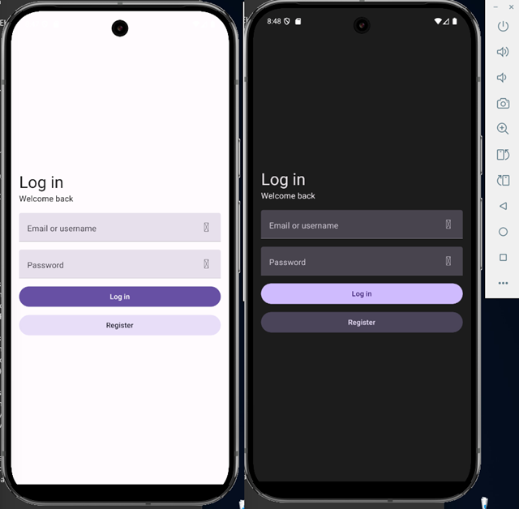

<p align="center">
  <a href="#" target="blank">
    
  </a>
</p>

# Fedora

Expense Tracker App

[](https://www.typescriptlang.org/docs/handbook/2/everyday-types.html)
[](https://reactnative.dev/docs/environment-setup)
[](https://docs.expo.dev/tutorial/create-your-first-app/)


## Setup

```sh
git clone https://github.com/2gbeh/fedora.git
cd fedora
```

```sh
npm cache clean --force
npm install
# OR npm install --legacy-peer-deps
```

## Usage

```sh
TODO: copy .env credentials
npx react-native run-android
```

## Documentation

Coming soon

## Screenshots


