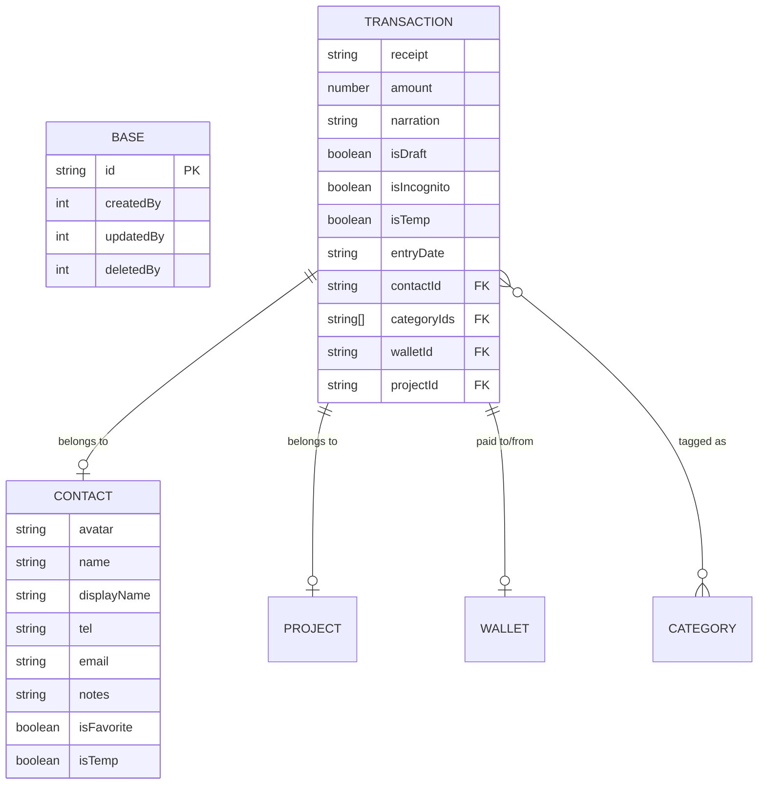

# Fedora

Personal Finance Ledger App


## Setup

```sh
git clone https://github.com/expo-cbt/app.git
cd app
```

```sh
npm install
npx expo start

# npx expo start -c --web
```

## Build

#### EAS Development Build (Android)

```sh
eas build --profile development --platform android
npx expo start --dev-client
```

## Documentation

#### Modules

- Contacts
- Transactions
- - Categories
- - Wallets
- Projects
- Settings

#### Screens

- Auth
- - Log in
- - Forgot Password
- Home (Dashboard)
- Analytics
- \<Manage Modules\>

#### Entity Relationship Diagram


```mermaid
erDiagram
    BASE {
        string id PK
        int createdBy
        int updatedBy
        int deletedBy
    }

   TRANSACTION {        
        string receipt
        number amount
        string narration
        boolean isDraft
        boolean isIncognito
        boolean isTemp
        string entryDate
        
        %% Foreign Keys (FK)
        string contactId FK
        string[] categoryIds FK
        string walletId FK
        string projectId FK
    }

   CONTACT {
        string avatar
        string name
        string displayName
        string tel
        string email
        string notes
        boolean isFavorite
        boolean isTemp
    }

    TRANSACTION ||--o| CONTACT : "belongs to"
    TRANSACTION ||--o| PROJECT : "belongs to"
    TRANSACTION ||--o| WALLET : "paid to/from"
    TRANSACTION }o--o{ CATEGORY : "tagged as"
```

## Resources

- https://expo.dev/new/develop

<!--
# Settings

- Toggle Debug
- Toggle Incognito
- [Clear TempData]
 -->
