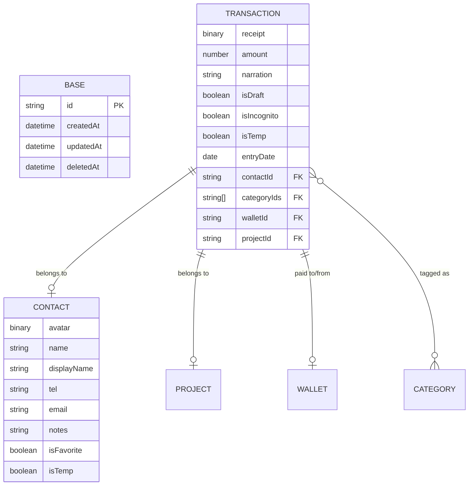

# Fedora

Personal Finance Ledger App


## Setup

```sh
git clone https://github.com/expo-cbt/app.git
cd app
```

```sh
npm install
npx expo start

# npx expo start -c --web
```

## Build

#### EAS Development Build (Android)

```sh
eas build --profile development --platform android
npx expo start --dev-client
```

## Documentation

### Modules

- Contacts
- Transactions
- - Categories
- - Wallets
- Projects
- Settings

### Screens

- Auth
- - Log in
- - Forgot Password
- Home (Dashboard)
- Analytics
- CRUD Modules

### Settings

- Toggle Mask Balance
- Toggle Debug
- Toggle Incognito
- Manage Categories
- Manage Wallets
- Manage Amount Options
- - 2k | 5k | 10k
- - 18k | 20k | 50k
- - 200k | 400k | 800k
- Manage Narration Options
- - %month Salary
- - %month Tithe
- - %month Market
- Clear TempData (isTemp)

### Transaction Wizard

**Select Recipient:**

- Recent | Favorites
- [Cancel][Add New]
- `Transaction History`

**Enter Amount:**

- - Amount Options
- Narration
- - Narration Options
- Categories
- [Back][Continue]
- `Transaction Statement`

**Transaction Details (form or widget):**

- Transaction Date (calendar)
- Wallet Options
- Project Options
- Upload Receipt
- [Back][Preview]

**Preview Sheet:**

- Mark as Draft
- Mark as Incognito
- [Back][Save]

**Success Modal:**

- [Select Receipt]
- [Enter Amount]
- [Close]

### Entity Relationship Diagram


```mermaid
erDiagram
    BASE {
        string id PK
        datetime createdAt
        datetime updatedAt
        datetime deletedAt
    }

   TRANSACTION {
        binary receipt
        number amount
        string narration
        boolean isDraft
        boolean isIncognito
        boolean isTemp
        date entryDate

        %% Foreign Keys (FK)
        string contactId FK
        string[] categoryIds FK
        string walletId FK
        string projectId FK
    }

   CONTACT {
        binary avatar
        string name
        string displayName
        string tel
        string email
        string notes
        boolean isFavorite
        boolean isTemp
    }

    TRANSACTION ||--o| CONTACT : "belongs to"
    TRANSACTION ||--o| PROJECT : "belongs to"
    TRANSACTION ||--o| WALLET : "paid to/from"
    TRANSACTION }o--o{ CATEGORY : "tagged as"
```

## Resources

- https://expo.dev/new/develop
