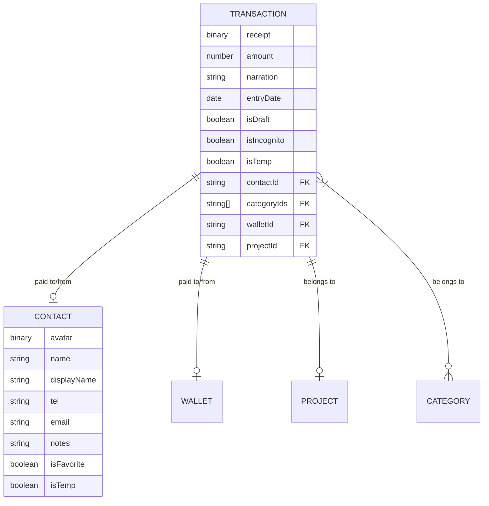
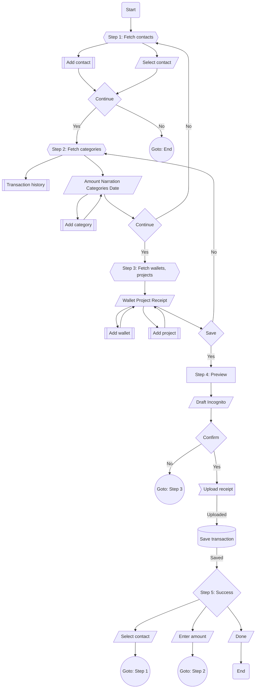

# Fedora

Personal Finance Ledger App


## Setup

```sh
git clone https://github.com/expo-cbt/app.git
cd app
```

```sh
pnpm install
npx expo start
# npx expo start -c --web
```

## Build

#### EAS Development Build (Android)

```sh
eas build --profile development --platform android
npx expo start --dev-client
```

## Documentation

### Data Model

**Entity Relationship Diagram (ERD)**


```mermaid
erDiagram
   TRANSACTION {
        binary receipt
        number amount
        string narration
        date entryDate
        boolean isDraft
        boolean isIncognito
        boolean isTemp

        %% Foreign Keys (FK)
        string contactId FK
        string[] categoryIds FK
        string walletId FK
        string projectId FK
    }

   CONTACT {
        binary avatar
        string name
        string displayName
        string tel
        string email
        string notes
        boolean isFavorite
        boolean isTemp
    }

    TRANSACTION ||--o| CONTACT : "paid to/from"
    TRANSACTION ||--o| WALLET : "paid to/from"
    TRANSACTION ||--o| PROJECT : "belongs to"
    TRANSACTION }|--o{ CATEGORY : "belongs to"
```

### Data Flow

**Flowchart**


```mermaid
flowchart TD
    Start(Start)
    Step1Ref((Goto: Step 1))
    Step1{{Step 1: Fetch contacts}}
    AddContact[[Add contact]]
    Contact[/Select contact/]
    Step1Next{Continue}
    Step2Ref((Goto: Step 2))
    Step2{{Step 2: Fetch categories}}
    History[[Transaction history]]
    Step2Form[/Amount Narration Categories Date/]
    AddCategory[[Add category]]
    Step2Next{Continue}
    Step3Ref((Goto: Step 3))
    Step3{{Step 3: Fetch wallets, projects}}
    Step3Form[/Wallet Project Receipt/]
    AddWallet[[Add wallet]]
    AddProject[[Add project]]
    Step3Next{Save}
    Step4[Step 4: Preview]
    Step4Form[/Draft Incognito/]
    Step4Next{Confirm}
    Storage>Upload receipt]
    Database[(Save transaction)]
    Step5{Step 5: Success}
    Step5Next1[/Select contact/]
    Step5Next2[/Enter amount/]
    Step5Next3[/Done/]
    EndRef((Goto: End))
    End(End)

    Start --> Step1
    Step1 --> AddContact
    Step1 --> Contact
    AddContact --> Step1Next
    Contact --> Step1Next
    Step1Next -- Yes --> Step2
    Step1Next -- No --> EndRef
    Step2 --> Step2Form
    Step2 --> History
    Step2Form --> Step2Next
    Step2Form --> AddCategory
    AddCategory --> Step2Form
    Step2Next -- Yes --> Step3
    Step2Next -- No --> Step1
    Step3 --> Step3Form
    Step3Form --> Step3Next
    Step3Form --> AddWallet
    AddWallet --> Step3Form    
    Step3Form --> AddProject
    AddProject --> Step3Form    
    Step3Next -- Yes --> Step4
    Step3Next -- No --> Step2
    Step4 --> Step4Form
    Step4Form --> Step4Next
    Step4Next -- Yes --> Storage
    Step4Next -- No --> Step3Ref
    Storage -- Uploaded --> Database
    Database -- Saved --> Step5
    Step5 --> Step5Next1 
    Step5 --> Step5Next2 
    Step5 --> Step5Next3 
    Step5Next1 --> Step1Ref
    Step5Next2 --> Step2Ref
    Step5Next3 --> End 
```

### Core Modules

- Contacts
- Transactions
- - Categories
- - Wallets
- Projects
- Settings

### App Screens

- Auth
- - Log in
- - Forgot Password
- Home (Dashboard)
- Analytics
- CRUD Modules

### App Settings

- Toggle Mask Balance
- Toggle Debug
- Toggle Incognito
- Manage Categories
- Manage Wallets
- Manage Amount Options
- - 2k | 5k | 10k
- - 18k | 20k | 50k
- - 200k | 400k | 800k
- Manage Narration Options
- - %month Salary
- - %month Tithe
- - %month Market
- Clear TempData (isTemp)

### Transaction Wizard

**MVP**

```sh
# Form Sheet
- Contact
- Receipt
- Amount
- Narration
- Categories
- Wallet
- Project
- Date (calendar)
- [Back|Reset][Save]

# Bottom Sheet
- Mark as Draft
- Mark as Incognito
- [Cancel][Confirm]

# Modal
- [Back][Close]
```

**V1**

```sh
# Step 1
/ Add Contact
- Select Contact
- Recent | Favorites
- [Back][Continue]

# Step 2
/ Transaction History
- Amount
- - Amount Options (chips)
- Narration
- - Narration Options (chips)
- Categories (sheet)
- Date (calendar)
- [Back][Continue]

# Step 3
- Wallet (sheet)
- Project (sheet)
- Attach Receipt
- [Back][Save]

# Step 4 (sheet)
- Mark as Draft
- Mark as Incognito
- [Cancel][Confirm]

# Step 5 (modal)
- [Select Contact]
- [Enter Amount]
- [Done]
```

## Resources

- https://expo.dev/new/develop
